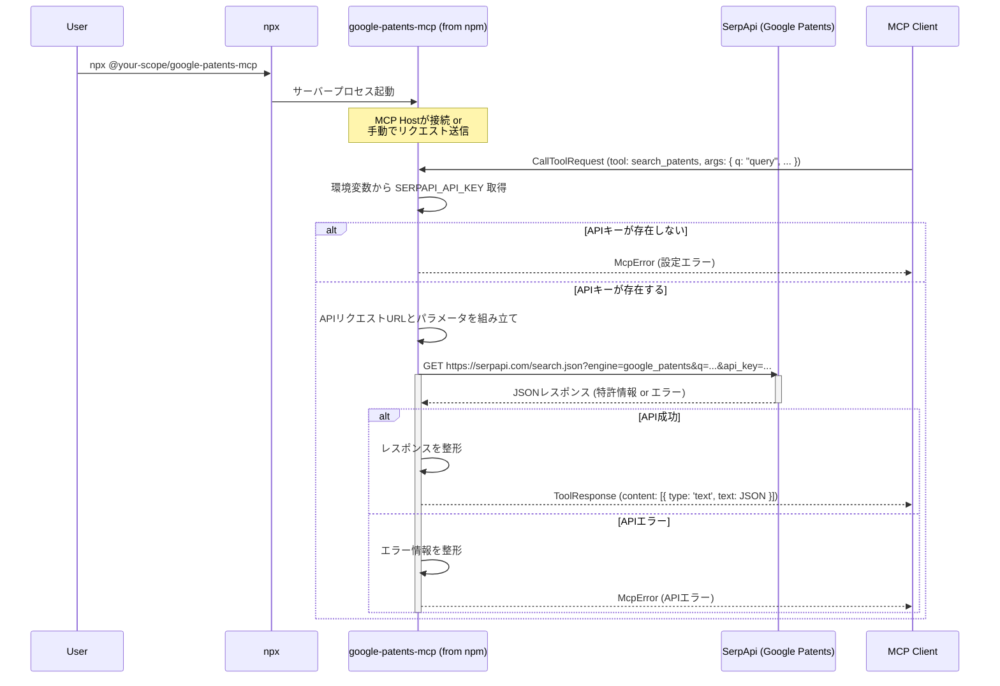

# Google Patents MCP サーバー開発計画書

## 0. 参照リソース
Google Patents API https://serpapi.com/google-patents-api
claude-code-mcp https://github.com/KunihiroS/claude-code-mcp

## 1. 開発目標

*   SerpApi の Google Patents API を利用して特許情報を検索できる新しい MCP (Model Context Protocol) サーバー (`google-patents-mcp`) を開発します。
*   既存の `claude-code-mcp` のプロジェクト構造、TypeScript による実装、ロギング、設定読み込みの仕組みを再利用します。
*   最低限、検索クエリ (`q`) を指定して特許情報を検索する MCP ツール (`search_patents`) を提供します。
*   **【追加】** 開発したサーバーを npm パッケージとして公開し、ユーザーがローカルにリポジトリをクローンしたりインストールしたりすることなく、`npx @your-scope/google-patents-mcp` のようなコマンドで直接実行できるようにします。(`npx` のキャッシュ機能により、二度目以降の実行は高速化されます。)

## 2. 前提条件

*   **Node.js と npm:** ユーザーの実行環境に Node.js (v18 以上推奨) と npm (または互換パッケージマネージャー) がインストールされていること。(`npx` コマンドの実行に必要です。)
*   **SerpApi API キー:** Google Patents API を利用するための SerpApi の有効な API キーを持っていること。

## 3. 開発アプローチ

*   既存の `claude-code-mcp` リポジトリをコピーまたはフォークし、新しいプロジェクト `google-patents-mcp` を作成します。
*   API リクエストのために `axios` ライブラリを追加します。
*   SerpApi の API キーは環境変数 (`SERPAPI_API_KEY`) で管理し、`.env` ファイルまたは MCP Host 設定から読み込めるようにします。
*   **【追加】** 開発完了後、npm にパッケージとして公開できるように準備します。

## 4. 主要な開発ステップ

1.  **プロジェクトセットアップ:**
    *   `claude-code-mcp` ディレクトリをコピーして `google-patents-mcp` を作成します。
    *   `google-patents-mcp/package.json` を編集し、パッケージ名 (`@your-scope/google-patents-mcp` など、npm で利用可能な一意の名前にする必要があります)、バージョン、説明、リポジトリ情報などを更新します。`bin` フィールドが正しく設定されていることを確認します (`npx` 実行に必要)。`files` フィールドに必要なファイルが含まれているか確認します。
    *   `google-patents-mcp/claude-code-server` ディレクトリ名を `google-patents-server` など、より適切な名前に変更します (任意)。以降、このディレクトリ名を `google-patents-server` とします。
    *   `google-patents-server` ディレクトリに移動し、`npm install axios` を実行して依存関係を追加します。
2.  **設定ファイルの準備:**
    *   `google-patents-server/.env.example` を更新し、`SERPAPI_API_KEY` を必須の環境変数として記載します。
    *   `google-patents-server/src/index.ts` 内の環境変数読み込みロジックを修正し、`SERPAPI_API_KEY` を読み込むようにします。
3.  **MCP ツール定義:**
    *   `google-patents-server/src/index.ts` 内の `ListToolsRequestSchema` ハンドラを修正し、`search_patents` ツール (必須パラメータ `q`) を定義します。既存の Claude Code 関連ツール定義は削除します。
4.  **ツールハンドラ実装:**
    *   `CallToolRequestSchema` ハンドラを修正し、`search_patents` ツールの処理を実装します。
    *   環境変数から `SERPAPI_API_KEY` を取得します。
    *   引数と API キーを使って SerpApi エンドポイントへの URL を組み立てます (`engine=google_patents` を含める)。
    *   `axios.get()` で API リクエストを実行します。
    *   成功/失敗に応じて適切なレスポンスまたは `McpError` を返します。
    *   既存の Claude Code 関連ロジックは削除します。
5.  **ロギング:**
    *   既存のロギング設定を活用し、API 通信やエラーに関するログを追加します。API キーはログに出力しません。
6.  **ドキュメント更新:**
    *   プロジェクトルートの `README.md` を全面的に書き換え、新しいサーバーの目的、**`npx` での実行方法**、設定方法 (`SERPAPI_API_KEY`)、提供ツールについて説明します。
7.  **ビルド:**
    *   `npm run build` を実行して JavaScript にコンパイルします。
8.  **【追加】npm パッケージ公開準備:**
    *   `package.json` の `name`, `version`, `description`, `keywords`, `author`, `license`, `repository`, `homepage`, `bugs` などのフィールドが npm 公開に適した内容になっているか確認・修正します。特に `name` は npm 上で一意である必要があります。
    *   公開前に不要なファイルが含まれないように `.npmignore` ファイルを作成・設定します（または `package.json` の `files` フィールドを適切に設定します）。
    *   ローカルでのテスト (`npm pack` でパッケージを作成し、別の場所で `npx ./path/to/package.tgz` を試すなど) を行います。
9.  **テスト:**
    *   ローカルでサーバーを起動し、`curl` などで MCP リクエストを送信して動作を確認します。
    *   可能であれば、実際に `npx` コマンドで (公開前ならローカルの tgz ファイルを指定して) 実行し、動作を確認します。
10. **【追加】npm パッケージ公開 (ユーザー実施または指示):**
    *   準備が整ったら、`npm login` で npm アカウントにログインし、`npm publish` コマンドでパッケージを公開します。(このステップは通常、開発者自身が行います。)

## 5. 成果物

*   SerpApi を介して Google Patents API に接続し、特許情報を検索する機能を持つ、独立した MCP サーバー。
*   **【追加】** npm に公開され、`npx` コマンドで直接実行可能なパッケージ。
*   設定方法と `npx` での使用方法が記載された `README.md`。

## 6. 開発フロー図 (Mermaid)

